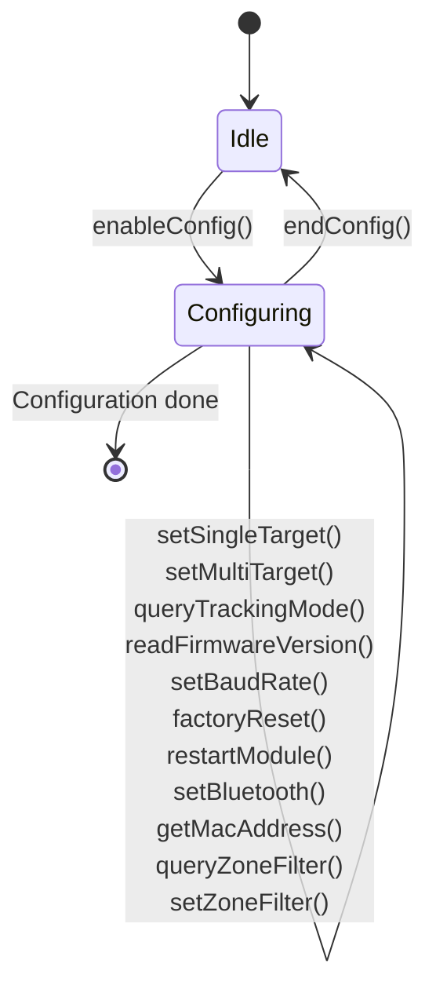
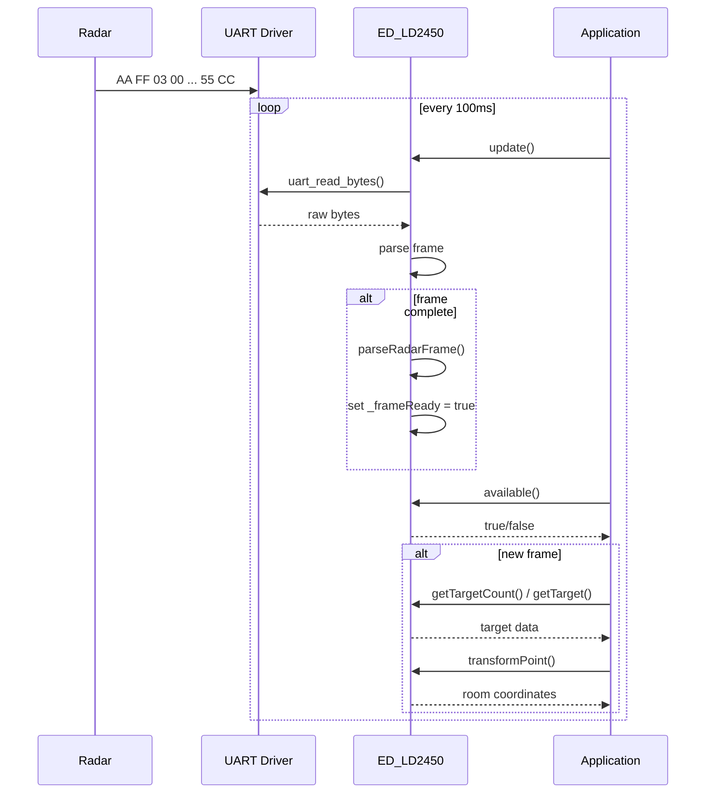
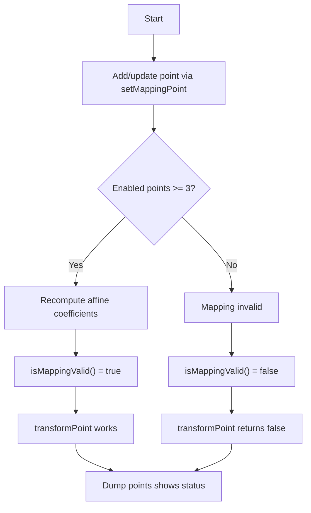

# ED_LD2450 Library for ESP32 (ESP‑IDF)

**Full-featured driver for the Hi‑Link LD2450 24GHz radar module** – works with ESP32‑C6 and any ESP32 series using ESP‑IDF v5.0+. Provides UART communication, command handling, data parsing, and a **dynamic coordinate remapping** system to transform radar‑native (x,y) into arbitrary room‑space coordinates.

---

## Table of Contents

- [ED\_LD2450 Library for ESP32 (ESP‑IDF)](#ed_ld2450-library-for-esp32-espidf)
  - [Table of Contents](#table-of-contents)
  - [Features](#features)
  - [Hardware Connection](#hardware-connection)
  - [Installation](#installation)
  - [Quick Start](#quick-start)
  - [API Reference](#api-reference)
    - [Class: `ED_LD2450`](#class-ed_ld2450)
      - [Lifecycle](#lifecycle)
      - [Data Structure](#data-structure)
    - [Configuration Commands](#configuration-commands)
    - [Mapping Management](#mapping-management)
      - [Mapping Point Storage](#mapping-point-storage)
      - [Methods](#methods)
      - [Example – dynamic mapping via MQTT](#example--dynamic-mapping-via-mqtt)
  - [Coordinate Remapping in Detail](#coordinate-remapping-in-detail)
    - [When to Use](#when-to-use)
  - [Mermaid Diagrams](#mermaid-diagrams)
    - [State Machine of Radar Configuration](#state-machine-of-radar-configuration)
    - [Data Flow – Radar → Application](#data-flow--radar--application)
    - [Mapping Point Management](#mapping-point-management)
  - [Troubleshooting](#troubleshooting)
  - [References](#references)
  - [License](#license)

---

## Features

- **Full command set** – enable/end config, single/multi‑target tracking, query mode, firmware version, baud rate, factory reset, restart, Bluetooth toggle, MAC address, zone filtering.
- **Automatic data parsing** – extracts up to 3 targets with X, Y, speed (cm/s) and distance resolution (mm).
- **Non‑blocking** – `update()` drains UART buffer; `available()` signals new frames.
- **Flexible coordinate mapping** – dynamically add, update, enable/disable up to 8 reference points; affine least‑squares transform maps radar coordinates to room coordinates.
- **Pure ESP‑IDF** – no Arduino dependencies.
- **Thread‑safe** – designed for FreeRTOS tasks.

---

## Hardware Connection

The LD2450 operates at **3.3V logic** but requires a **5V power supply** (≥200 mA). Connect as follows:

| LD2450 Pin | ESP32 Pin        | Note |
|------------|------------------|------|
| `5V`       | External 5V supply | Do **not** use ESP32 3.3V – range degrades. |
| `GND`      | GND              | Common ground. |
| `TX`       | RX (e.g., GPIO5) | 3.3V logic, safe. |
| `RX`       | TX (e.g., GPIO4) | 3.3V logic, safe. |

**Crucial – pull‑up resistors required**
Both `TX` and `RX` pins need **4.7 kΩ – 10 kΩ** resistors pulled to **3.3V** (not 5V). Without them, the module may not initialise or communicate reliably.

```text
LD2450           ESP32
======           =====
  TX ──[10kΩ]── 3.3V   (pull-up)
  TX ─────────── RX     (signal)
  RX ──[10kΩ]── 3.3V   (pull-up)
  RX ─────────── TX     (signal)
  VCC ────────── 5V     (external)
  GND ────────── GND
```

---

## Installation

1. Copy the `ED_SNS_LD2450` component folder into your project’s `components/` directory:

```text
components/
└── ED_SNS_LD2450/
    ├── CMakeLists.txt
    ├── ED_LD2450.cpp
    └── ED_LD2450.h
```

2. In `main/CMakeLists.txt`, require the component:

```cmake
idf_component_register(SRCS "main.cpp"
                    INCLUDE_DIRS "."
                    REQUIRES ED_SNS_LD2450)
```

3. Build as usual:

```bash
idf.py set-target esp32c6   # or your chip
idf.py build
```

---

## Quick Start

```cpp
#define CONFIG_IDF_TARGET_ESP32C6
#include "ed_board.h"          // provides RADAR_UART_NUM, RADAR_TX_PIN, RADAR_RX_PIN
#include "ED_LD2450.h"

ED_LD2450 radar;

void app_main() {
    radar.begin(RADAR_UART_NUM, RADAR_TX_PIN, RADAR_RX_PIN, 256000);
    vTaskDelay(pdMS_TO_TICKS(1000));

    // Configure
    if (radar.enableConfig()) {
        radar.setMultiTarget();
        radar.endConfig();
    }

    // Optionally set mapping points
    int16_t radarX[4] = {  100,  500,  500,  100 };
    int16_t radarY[4] = {  100,  100,  500,  500 };
    int16_t roomX[4]  = {    0, 2000, 2000,    0 };
    int16_t roomY[4]  = {    0,    0, 2000, 2000 };
    radar.setMappingPoints(radarX, radarY, roomX, roomY);

    while (1) {
        radar.update();
        if (radar.available()) {
            uint8_t cnt = radar.getTargetCount();
            LD2450_Target t;
            if (radar.getTarget(0, t)) {
                float rx, ry;
                radar.transformPoint(t.x, t.y, rx, ry);
                ESP_LOGI("MAIN", "Target: radar(%d,%d) → room(%.1f,%.1f)", t.x, t.y, rx, ry);
            }
        }
        vTaskDelay(pdMS_TO_TICKS(100));
    }
}
```

---

## API Reference

### Class: `ED_LD2450`

#### Lifecycle

| Method | Description |
|--------|-------------|
| `ED_LD2450()` | Constructor – initialises internal state. |
| `~ED_LD2450()` | Destructor – releases UART driver. |
| `esp_err_t begin(uart_port_t, int tx, int rx, uint32_t baud=256000)` | Initialises UART with given pins and baud rate. Returns `ESP_OK` on success. |
| `void update()` | **Must be called frequently** – reads incoming bytes, parses complete radar frames. |
| `bool available()` | Returns `true` if a fresh radar frame has been parsed since last call. Clears flag after reading. |
| `uint8_t getTargetCount()` | Returns number of active targets (0 – 3). |
| `bool getTarget(uint8_t index, LD2450_Target &target)` | Copies target data if index < count and target exists; returns `false` otherwise. |

#### Data Structure

```cpp
struct LD2450_Target {
    int16_t x;          // radar X coordinate [mm]
    int16_t y;          // radar Y coordinate [mm]
    int16_t speed;      // speed [cm/s] (positive = moving away? check sign)
    uint16_t resolution; // distance resolution [mm]
};
```

---

### Configuration Commands

All configuration commands follow the protocol: **send `enableConfig()` first, issue commands, then `endConfig()`**.

| Method | Description | Return |
|--------|-------------|--------|
| `enableConfig()` | Enter configuration mode. Must be called before any other command. | `bool` |
| `endConfig()` | Exit configuration mode, resume normal operation. | `bool` |
| `setSingleTarget()` | Switch to single‑target tracking. | `bool` |
| `setMultiTarget()` | Switch to multi‑target tracking (default). | `bool` |
| `queryTrackingMode(uint16_t &mode)` | Get current mode: `0x0001` = single, `0x0002` = multi. | `bool` |
| `readFirmwareVersion(std::string &version)` | Returns string like `"V1.02.22062416"`. | `bool` |
| `setBaudRate(uint16_t index)` | Change baud rate (index from 1 – 8, see datasheet). Takes effect after restart. | `bool` |
| `factoryReset()` | Restore all settings to factory defaults. | `bool` |
| `restartModule()` | Reboot the radar module. | `bool` |
| `setBluetooth(bool enable)` | Enable/disable Bluetooth (default on). | `bool` |
| `getMacAddress(std::string &mac)` | Returns MAC as `"XX:XX:XX:XX:XX:XX"`. | `bool` |
| `queryZoneFilter(uint8_t &type, int16_t coords[3][4])` | Read zone‑filter config (type = 0/1/2, each zone has x1,y1,x2,y2). | `bool` |
| `setZoneFilter(uint8_t type, int16_t coords[3][4])` | Write zone‑filter config. | `bool` |

---

### Mapping Management

The library provides a flexible coordinate mapping system that transforms radar‑native (`x,y`) into room‑space (`X,Y`) using an **affine least‑squares fit** from a set of reference points.

#### Mapping Point Storage

- Up to **8** reference points (`MAX_MAPPING_POINTS` = 8).
- Each point has: `radarX`, `radarY`, `roomX`, `roomY`, and `enabled` flag.
- Only **enabled** points are used to compute the transform.
- At least **3 non‑collinear enabled points** are required for a valid transform.

#### Methods

| Method | Description |
|--------|-------------|
| `bool setMappingPoint(uint8_t index, int16_t radarX, int16_t radarY, int16_t roomX, int16_t roomY, bool enable = true)` | Add or update a point by index. If previously disabled, it becomes enabled (unless `enable=false`). Automatically recomputes transform. |
| `bool enableMappingPoint(uint8_t index, bool enable)` | Enable/disable a point. Recomputes transform. |
| `bool clearMappingPoints()` | Disables all points and clears their data. Mapping becomes invalid. |
| `bool computeMapping()` | Manually recompute transform from current enabled points – normally not needed as changes auto‑recompute. |
| `std::string dumpMappingPoints()` | Returns a formatted string listing all points with index, radar coords, room coords, and status. Useful for debugging. |
| `bool setMappingPoints(const int16_t radarX[4], const int16_t radarY[4], const int16_t roomX[4], const int16_t roomY[4])` | **Backward‑compatible**: clears all, sets exactly 4 points as enabled. |
| `bool transformPoint(int16_t rx, int16_t ry, float &roomX, float &roomY)` | Applies the affine transform to convert radar coordinates to room coordinates. Returns `false` if mapping invalid. |
| `bool isMappingValid() const` | Returns `true` if at least 3 enabled points allow a valid transform. |

#### Example – dynamic mapping via MQTT

```cpp
void handleMappingCommand(const char *cmd) {
    char type[10]; int idx, rx, ry, rrX, rrY, en;
    if (sscanf(cmd, "%s %d %d %d %d %d %d", type, &idx, &rx, &ry, &rrX, &rrY, &en) == 7) {
        if (strcmp(type, "set") == 0) {
            radar.setMappingPoint(idx, rx, ry, rrX, rrY, en);
        }
    } else if (sscanf(cmd, "enable %d %d", &idx, &en) == 2) {
        radar.enableMappingPoint(idx, en);
    } else if (strcmp(cmd, "clear") == 0) {
        radar.clearMappingPoints();
    } else if (strcmp(cmd, "dump") == 0) {
        ESP_LOGI(TAG, "%s", radar.dumpMappingPoints().c_str());
    }
}
```

---

## Coordinate Remapping in Detail

The affine transform is computed as:

```text
roomX = a * radarX + b * radarY + c
roomY = d * radarX + e * radarY + f
```

Where `(a, b, c, d, e, f)` are solved using **least‑squares** from all enabled mapping points. This handles translation, rotation, scaling, and skew – ideal for arbitrary room geometries.

The solver uses Gaussian elimination with partial pivoting; it requires at least 3 non‑collinear points. If more points are provided, the least‑squares solution minimises the overall error.

### When to Use

- **Static mapping**: Define 4 corners of a rectangular room and call `setMappingPoints(arrays)` once during startup.
- **Dynamic calibration**: Send MQTT commands to add/remove points while the system runs – the transform updates instantly.
- **Fault‑tolerant**: If a point is wrong or temporary, disable it; the transform uses only the remaining valid points.

---

## Mermaid Diagrams

### State Machine of Radar Configuration



### Data Flow – Radar → Application



### Mapping Point Management



---

## Troubleshooting

| Problem | Likely Cause | Solution |
|---------|--------------|----------|
| `enableConfig()` fails | Missing pull‑up resistors; wrong wiring | Add 4.7 kΩ pull‑ups on TX and RX to 3.3V. Check UART pins. |
| No data received | UART baud mismatch; module not powered | Default baud is 256000. Ensure 5V supply >200 mA. |
| `available()` always false | `update()` not called often enough | Call `update()` in every loop iteration (at least every 10 ms). |
| Mapping invalid after adding 4 points | Points are collinear or too close | Spread points across the whole room; ensure they are not on a line. |
| Transformed coordinates are wildly wrong | Mapping points entered with wrong sign or units | Radar coordinates are in mm; room coordinates must also be in mm. |
| Compilation errors | Missing `REQUIRES` in CMake | Add `REQUIRES driver esp_timer log` to component’s `CMakeLists.txt`. |

---

## References

- LD2450 Serial Communication Protocol V1.03 (provided with the library)
- [DeepSeek Chat – Development discussion for this library](https://chat.deepseek.com/a/chat/s/a3bfcb8f-c631-47f4-9878-93c4c7162a97)

---

## License

This library is provided under the **MIT License**. You are free to use, modify, and distribute it, provided that the original copyright notice is retained.

---

*Happy tracking with your LD2450!* 🚀
```